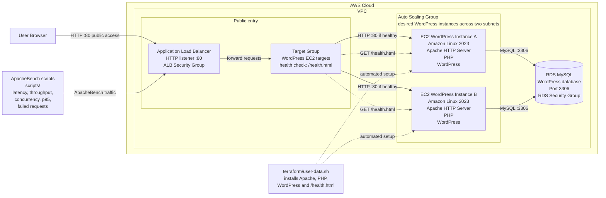
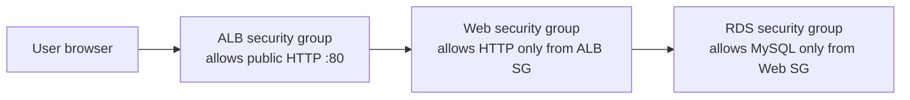

# Final AWS Web Service Project: WordPress HA with ALB, ASG, RDS, and Benchmarking

This repository is a small AWS-based web service project that combines the class concepts used in the attached labs:

- Terraform Infrastructure as Code
- EC2 web servers
- Application Load Balancer
- Auto Scaling Group for high availability
- RDS MySQL database for WordPress
- ApacheBench benchmarking scripts

The service deploys WordPress on EC2 instances managed by an Auto Scaling Group. The instances are registered behind an Application Load Balancer. WordPress uses a private RDS MySQL database instead of a local MariaDB database, so replacement EC2 instances can reconnect to the same database.

## Architecture

```text
Internet
   |
   v
Application Load Balancer :80
   |
   v
Target Group health check: /health.html
   |
   v
Auto Scaling Group across two default-VPC subnets
   |
   v
EC2 WordPress instances on Amazon Linux 2023
   |
   v
Private RDS MySQL database
```

## Repository Structure

```text
.
├── README.md
├── docs
│   ├── architecture.md
│   ├── deployment.md
│   └── benchmarking.md
├── scripts
│   ├── analyze-summary.sh
│   ├── run-http-benchmark.sh
│   └── run-sample-scenarios.sh
└── terraform
    ├── .gitignore
    ├── main.tf
    ├── outputs.tf
    ├── terraform.tfvars.example
    ├── user-data.sh
    ├── variables.tf
    └── versions.tf
└── wp-content
    └── themes
         └── aws-cards-market-theme.zip
```

## Requirements

- AWS Academy or AWS CLI credentials configured in the shell
- Terraform >= 1.5.0
- A default VPC with at least two subnets in the selected AWS region
- ApacheBench for the benchmarking part

## Deploy

```bash
cd terraform
cp terraform.tfvars.example terraform.tfvars
export TF_VAR_db_master_password='AWS2026!'
terraform init
terraform fmt
terraform validate
terraform plan -out plan.out
terraform apply plan.out
```

After apply finishes, open the 
`http://final-wp-ha-alb-577588890.us-east-1.elb.amazonaws.com` output in a browser.

## Benchmark

From the repository root:

```bash
TARGET_URL="http://final-wp-ha-alb-577588890.us-east-1.elb.amazonaws.com" bash scripts/run-sample-scenarios.sh
bash scripts/analyze-summary.sh
```

The benchmark results are written to `results/`.

## Destroy

```bash
cd terraform
terraform destroy
```

## UML



## Security Group Flow




